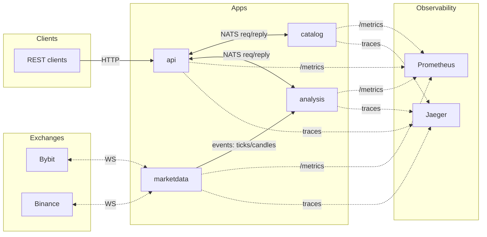

# Connector Monorepo (NestJS)

[](https://github.com/dephix/connector/actions/workflows/ci.yml)
[](https://github.com/dephix/connector/actions/workflows/release.yml)
[](https://github.com/dephix/connector/security/dependabot)
[](https://nodejs.org)
[](https://pnpm.io)
[](LICENSE)

This repository contains a NestJS monorepo organized around independent bounded contexts that communicate asynchronously via a broker.

- Bounded contexts as apps:
  - `api`: REST API facade that fans out to BCs over NATS
  - `catalog`: exchange/symbol catalog and lookups
  - `marketdata`: ingestion adapters for exchanges (REST/WS), emits market data events
  - `analysis`: computes analysis for symbols/exchanges upon requests or events
- Cross-cutting libs: `config`, `observability`, `contracts`.
- Observability included out of the box: structured logs (pino), Prometheus metrics, OpenTelemetry traces (OTLP → Collector → Jaeger).

## Quick start

```bash
pnpm install
cp .env.example .env
pnpm run compose:up
pnpm run start:all
```

Then check:

- API: `http://localhost:3000` (metrics at `/metrics`)
- Jaeger UI: `http://localhost:16686`
- Prometheus: `http://localhost:9090`
- Grafana: `http://localhost:3001`

## Configuration (.env)

See `.env.example`. You can set global variables and per-service ports:

```env
NATS_URL=nats://localhost:4222
OTEL_EXPORTER_OTLP_ENDPOINT=http://localhost:4317
LOG_LEVEL=info
API_PORT=3000
CATALOG_PORT=3010
MARKETDATA_PORT=3020
ANALYSIS_PORT=3030
```

## Documentation

- Service docs live in `docs/`.
- Monorepo reference: https://docs.nestjs.com/cli/monorepo
 
## Approach & Architecture

### Development approach
- DDD/Clean Architecture with independent apps (bounded contexts) communicating via broker (NATS)
- Separation: domain/application/infrastructure per context; API is a thin facade
- Observability first: logs (pino), metrics (Prometheus), traces (OTel)
- CI: lint, build, tests with coverage; Release: Docker images by tag

### High-level architecture


### Docker images

- Published to `ghcr.io/dephix/connector` on Git tag push.
- Tags per app: `vX.Y.Z-api`, `vX.Y.Z-catalog`, `vX.Y.Z-marketdata`, `vX.Y.Z-analysis`.
- Run example:

```bash
docker run --rm -e NATS_URL=nats://host.docker.internal:4222 -p 3000:3000 ghcr.io/dephix/connector:v0.1.0-api
```

### Coverage report (CI)
- HTML coverage is published via GitHub Pages when enabled. If Pages is not enabled for the repo/org policy, artifacts are still available in the CI run (`coverage-lcov`).
