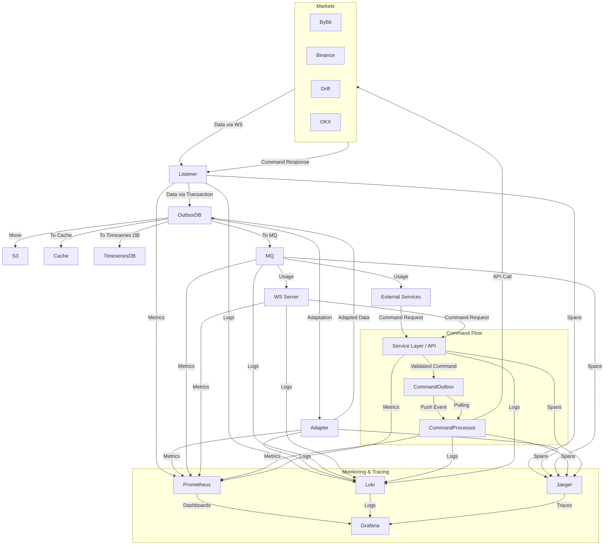

Connector is a layer of our strategy engine.

It receives data from markets (such as ByBit, Binance, Drift, etc.), pushes it to the outbox database, and then:
- moves the data to persistent storage (such as S3)
- adapts the data using an adapter and moves it to another outbox

The job uses the new outbox to:
- move data to the cache
- move data to the timeseries database
- move data to the message queue (MQ)

The MQ is used by other layers of our program and by the WebSocket (WS) server.

Here is scheme of data flow with monitoring & tracing:

